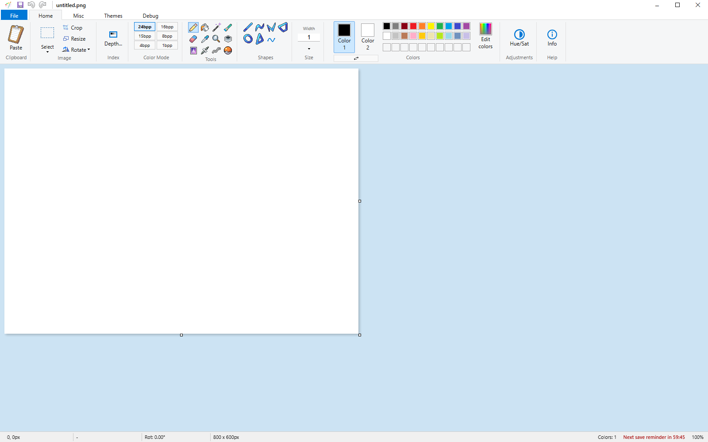

# CDPaint - GBA Asset Suite

[](https://tauri.app/)
[](https://nodejs.org/)
[](https://www.rust-lang.org/)

A painting app for pixel artists and retro game developers, built around the
constraints of real hardware. It keeps the familiar Windows Paint-style
workflow, but adds bit-depth enforcement, palette tools, and export helpers
aimed at Game Boy Advance (GBA) development.

**Try the live browser demo:** https://frcynda.github.io/CDPaint/

The demo runs best in Chromium-based browsers. Gecko-based browsers
(Firefox, LibreWolf, Waterfox, etc.) are noticeably slower.



## Features

- **Bit-depth locked painting** - Lock the whole canvas to a hardware color
  mode: 15bpp (RGB555), 16bpp (RGB565), or 8bpp indexed with a 256-color
  palette. Every stroke is quantized to the active mode, and you can switch
  modes live to convert existing artwork.
- **GBA export tools** - Drag-and-drop palette index reordering (so
  transparency lands on the right slot), automatic splitting of 64x128 /
  128x64 canvases into 64x64 front/back sprites, JASC-PAL import/export for
  decomp projects and Porymap, and a hardware preview of how the image will
  look on 15-bit output.
- **Image adjustments** - Channel-based HSL tuning (Master, R, Y, G, C, B, M)
  with a split-view comparison, color depth reduction with Floyd-Steinberg
  dithering and OKLab accuracy, and an edge cleaner that removes stray pixels
  while protecting your key colors.
- **Selection tools** - Magic wand with a distance-based tolerance slider
  (drag to live-expand), lasso and polyline selection, Shift/Ctrl/Alt boolean
  operations, and keyed transparency for floating selections.
- **Power-user workflow** - Fully rebindable hotkeys, tiled mode for seamless
  patterns, a free-floating canvas mode, and a 20x hover preview showing the
  exact pixel grid under the cursor.
- **Sprite editor** - Project browser for opening and saving sprite assets
  with exact palette and index preservation, plus a palette panel with PAL
  support.

## Tech stack

- Vanilla JavaScript (no frameworks), Canvas 2D with WebGL fragment shaders
  for strokes, transforms, and quantization
- Web Workers for heavy tasks (color clustering, HSL adjustments)
- Tauri 2 for the desktop shell (Rust backend for OS integration only)

## Project layout

```
src/          Frontend (HTML, CSS, JS modules)
src-tauri/    Tauri/Rust shell, config, icons
scripts/      Dev server, build, bundle and smoke-test tooling
tools/        Brush/palette helper scripts
test/         Algorithm tests (wand, reference implementations)
```

## Building and running

Prerequisites: Node.js LTS, Rust, and on Windows the Visual Studio Build
Tools with "Desktop development with C++".

```bash
npm install
npm run dev          # dev server at http://localhost:1420
npm run tauri:build  # desktop installer (NSIS/MSI, DMG, or AppImage/deb/rpm)
npm test             # smoke tests
```

Installers land in `src-tauri/target/release/bundle/`.

## Troubleshooting

- **"Command not found"** - The OS prerequisites aren't on PATH yet.
  Re-check the install guide for your OS and restart.
- **Installer folder is empty** - The build failed earlier. Scroll up in the
  terminal, fix the first error, and run `npm run tauri:build` again.
- **Windows SmartScreen warning** - Unsigned builds show this; click
  "More info" then "Run anyway".
- **macOS says the app is damaged** - System Settings -> Privacy & Security,
  find the blocked app, click "Open Anyway".
- **Linux AppImage won't open** - `chmod +x path/to/CDPaint.AppImage` first.

## Credits

Brush tip assets in `src/brushes/` come from David Revoy's Krita brush packs,
licensed under Creative Commons Attribution 4.0 (CC BY 4.0) to David Revoy,
[www.davidrevoy.com](https://www.davidrevoy.com). Some brushes were modified
locally for this project.

## License

The code is MIT licensed. Some bundled assets are not covered by the MIT
grant - see [LICENSE](LICENSE) for the full notice (Microsoft Paint UI
replicas, David Revoy's brushes, and Pokemon-related reference assets).